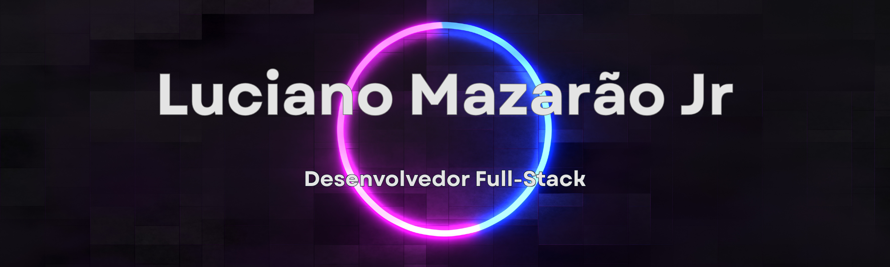

<div align="center">
  
</div>

<h1 align="center">👋 Olá! Eu sou o Luciano Mazarão Jr</h1>

<div align="center">
  
</div>

<p align="center">
  <a href="https://www.linkedin.com/in/luciano-mazarao-jr-264a342ba/">
    
  </a>
  <a href="mailto:lmazaraojr@gmail.com">
    
  </a>
  <a href="https://github.com/LucMazarJR">
    
  </a>
</p>

<p align="center">
  
</p>

---

## 🚀 Sobre Mim

<table>
<tr>
<td>

```typescript
const luciano = {
  nome: "Luciano Mazarão Jr",
  cargo: "Desenvolvedor Full Stack",
  educacao: "Engenharia de Software @ Uni-FACEF",
  localização: "Brasil 🇧🇷",
  foco: ["React", "Prisma", "APIs Escaláveis"],
  paixao: "Transformar ideias em soluções reais",
  valores: ["Inclusão", "Acessibilidade", "Inovação"]
};
```

</td>
</tr>
</table>

Sou **desenvolvedor full stack** e estudante de **Engenharia de Software na Uni-FACEF**, apaixonado por transformar ideias em soluções tecnológicas reais. Gosto de entender como as coisas funcionam por trás do código - do backend ao design da interface - e acredito que **a tecnologia deve ser acessível e inclusiva**.

🎯 **Atualmente estudando:** React, Prisma e arquitetura de APIs escaláveis, com foco em desenvolvimento web moderno, boas práticas e performance.

---

## 📊 Estatísticas do GitHub

<div align="center">
  
<a href="https://github.com/LucMazarJR">
  
  
</a>

</div>

<div align="center">
  
</div>

<div align="center">
  
</div>

---

## 🛠️ Tecnologias & Ferramentas

### 🧩 Linguagens


### ⚙️ Frameworks & Bibliotecas


### 🗄️ Banco de Dados & ORM


### ☁️ Ferramentas & DevOps


### 🎨 Frontend & Estilização


---

## 🏆 Projetos em Destaque

### 🌟 [Apojobs - Plataforma de Empregos Inclusiva](https://github.com/LucMazarJR/apojobs)


Plataforma web inclusiva que conecta **profissionais com deficiência (PCDs)** a **empresas comprometidas com diversidade e inclusão**.

**✨ Principais Features:**
- 📝 Formulários multi-etapas com validação completa
- 📊 Exportação de dados em formato Excel
- ♿ Interface totalmente acessível (WCAG)
- 🎨 Design system responsivo com Tailwind CSS
- 🔍 Sistema de busca e filtros avançados
- 🎯 **Missão:** Promover inclusão digital e profissional

---

### 🏥 [MedBot - Assistente Médico Virtual](https://github.com/DiegoHenriqueMelo/hackathon-2025)


Sistema de assistência médica virtual desenvolvido para o **Hackathon 2025**, com chatbot inteligente, autenticação e dashboards interativos.

**✨ Principais Features:**
- 🤖 Chatbot com IA integrada via OpenAI API
- 📊 Dashboards personalizados por perfil de usuário
- 🔐 Autenticação segura e controle de acesso
- 💻 CRUD completo com arquitetura escalável
- âš¡ Performance otimizada e cache inteligente

**👥 Equipe:** Davi Muniz, Diego Melo, Luciano Neves, Renan Prado

---

## 🎯 Objetivos 2025

```diff
+ Contribuir para projetos open source em React e Node.js
+ Aprofundar conhecimentos em Prisma ORM e arquitetura de APIs escaláveis
+ Criar um portfólio pessoal com projetos full-stack
+ Participar de novos hackathons e desafios técnicos
```

---

<div align="center">
  
### 💬 "A tecnologia é mais do que código - é sobre criar soluções que impactam vidas."

<br />


</div>
